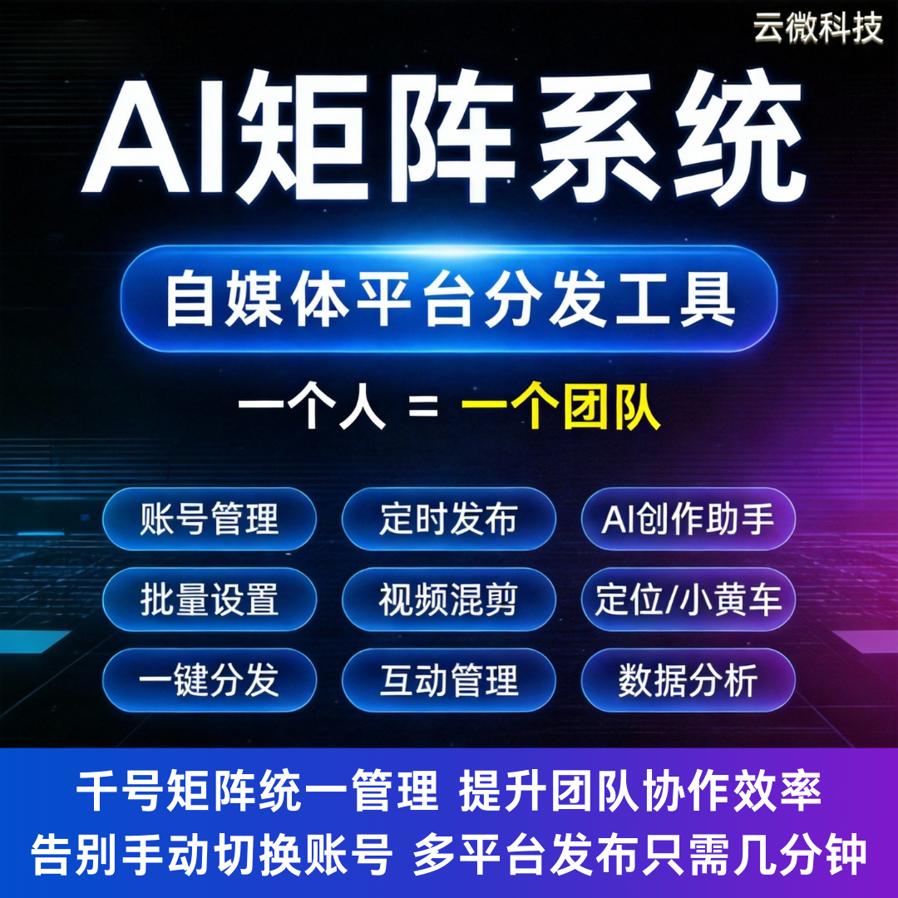

# AI 矩阵 + 短剧系统双赋能，一人干翻一个内容团队

还在靠堆人做短视频内容？编剧、画师、剪辑、运营配齐一套，成本高、管理难、产出还不稳定。

现在依靠AI 矩阵系统 + AI 短剧系统双引擎赋能，一个人就能完成一整个内容团队的工作量，低成本、高效率、稳定量产。

### 一、双系统加持，彻底解放人力

#### AI 短剧系统负责生产

- 自动生成剧本、人设、分镜，不用专职编剧；
- AI 作画、虚拟场景，省去画师与拍摄成本；
- 智能配音 + 字幕 + 自动剪辑，后期零人工；
- 短剧、漫剧、小说推文一键成片，日更几十条无压力。

#### AI 矩阵系统负责运营

- 多账号统一管理，批量发布、定时分发；
- 全平台一键分发，不用逐个登录切换；
- 数据统一复盘，自动筛选爆款逻辑；
- 账号状态实时监控，避免漏更、断更。

### 二、一人顶一个团队，效率直接拉满

- 过去 5-8 人才能支撑的矩阵账号，现在 1 人轻松搞定；
- 从内容生产到分发全流程自动化，不用熬夜赶片；
- 风格统一、输出稳定，不会因人手问题影响更新；
- 成本大幅下降，利润空间直接翻倍。

### 三、适合所有轻资产创业与内容团队

- **个人创业者**：低成本起号，快速放大流量收益；
- **MCN 机构**：精简团队，提升单产效率，扩赛道更轻松；
- **中小企业 & 门店**：自己做营销短剧，不用外包等高费用；
- **网文推文团队**：批量转漫剧短剧，转化率大幅提升。

### 四、落地简单，上手即用

系统由广州云微传媒提供完整部署与培训，支持贴牌与独立部署，无需技术基础，简单教学即可独立操作。

双系统联动，从 “写剧本→做成片→发矩阵” 全链路打通，真正实现高效内容变现。

## 🤝 商务微信：ywyy6798

内容行业不再是拼人头的时代，而是拼工具效率。

AI 矩阵 + 短剧系统双赋能，让一个人拥有一整个团队的产能，低成本、高产出、稳变现，是当下内容创业最具性价比的模式。

