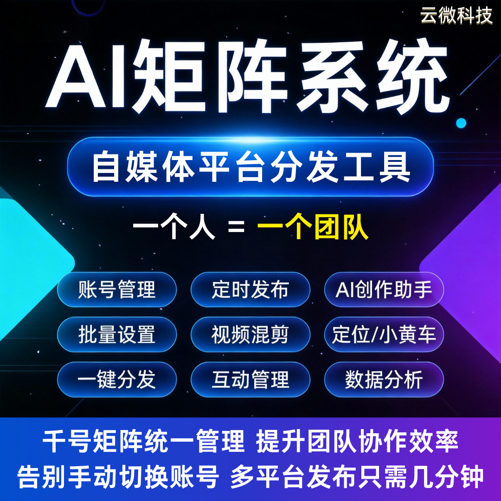
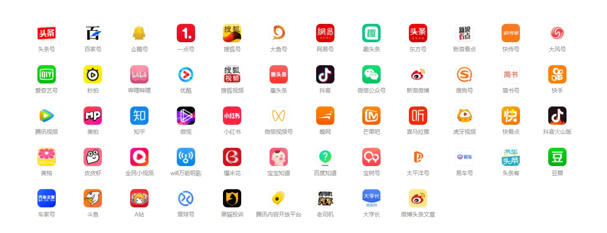

# AI矩阵系统 | 自媒体多平台批量运营神器 源码全交付

专注AI矩阵系统开发，专为自媒体人、企业商家、创业者打造，一站式解决新媒体创作、多账号管理、多平台分发、精细化运营全痛点。依托Deepseek大模型赋能，支持70+平台、1000+账号统一管控，AI批量创作、视频混剪、一键分发、数据统计全覆盖，源码全量交付，功能免费升级，实体公司全程护航，一人即可搞定团队级运营工作，低成本抢占自媒体流量风口。

### 一、核心获客亮点：为什么选我们的AI矩阵系统？

-  **源码全量交付** ：无版权绑定，支持独立部署与二次开发，数据自主可控，后期无需依赖第三方，适配长期运营与个性化拓展需求；

-  **极致效率提升** ：5分钟完成多平台分发，1分钟混剪出千条视频，告别手动操作，一人替代整个运营团队，大幅降低人力成本；

-  **全场景适配** ：覆盖自媒体创作、企业新媒体推广、创业者副业运营等场景，70+平台、1000+账号统一管理，全域流量布局更轻松；

-  **长期保障无忧** ：实体公司打造，功能免费终身升级，从部署到运营全程对接，新手也能快速上手。

### 二、核心功能：全链路覆盖，运营效率拉满

#### 1. 多账号多平台统一管控（核心优势）

-  **多平台适配** ：支持70+主流新媒体平台，30+平台可一键分发文章、视频、图文，覆盖抖音、快手、微信、小红书等全渠道；

-  **多账号管理** ：1000+账号统一后台管控，批量导入账号、分组管理，无需切换平台，高效统筹所有运营账号；

-  **智能分发** ：支持定时发布、批量分发，5分钟完成多平台内容推送，杜绝漏发、错发，解放运营双手。

#### 2. AI智能创作+视频混剪，内容产出无压力

-  **AI批量创作** ：Deepseek大模型赋能，一键生成营销文案、短视频脚本、图文内容，适配不同平台调性，无需手动撰写；

-  **高效视频混剪** ：1分钟出千条混剪视频，内置水印添加、画面裁剪、转场特效等基础剪辑功能，无需专业剪辑技巧；

-  **内容优化** ：支持内容去重、二次创作，提升内容原创度，助力平台流量推荐，降低违规风险。

#### 3. 精细化运营+数据可视化，决策更精准

-  **智能互动** ：评论、私信自动回复，精准对接用户咨询，提升用户粘性，减少人工回复成本；

-  **数据统计** ：实时监控播放量、粉丝量、收益、转化率等核心数据，数据看板直观呈现，运营效果一目了然；

-  **精细化管控** ：支持内容审核、违规预警，账号健康度实时监测，保障运营合规性，规避账号风险。

#### 4. 便捷部署+长期服务，落地无忧

-  **简单部署** ：配套详细部署教程，新手也能轻松完成独立部署，无需专业技术储备；

-  **免费升级** ：功能终身免费升级，紧跟新媒体平台规则与AI技术迭代，持续适配运营需求；

-  **灵活适配** ：支持成品部署、定制化开发，按需调整功能模块，适配自媒体、企业、创业者不同预算与需求。

### 三、适配人群：精准匹配三大核心客户

-  **自媒体人** ：多账号、多平台同步运营，提升内容更新频率，快速涨粉变现；

-  **企业商家** ：批量布局新媒体矩阵，高效推广品牌、引流获客，降低运营成本；

-  **创业者/副业者** ：零门槛启动新媒体副业，一人搞定全流程运营，低成本高回报。

### 四、合作保障：实体公司 全程护航

-  **专业团队** ：多年新媒体AI系统开发经验，Deepseek大模型深度适配，系统稳定无卡顿；

-  **全流程服务** ：需求沟通、源码交付、部署指导、售后维护一站式对接，拒绝繁琐流程；

-  **实体对接** ：支持随时面谈，签订正式合同，权益有保障，杜绝虚拟团队跑路风险；

-  **售后无忧** ：优秀技术团队，及时解决部署、使用中的各类问题，运营全程兜底。

### 商务对接：低成本启动，高效盈利

系统价格灵活可议，源码全交付，支持成品快速部署、定制化开发，按需匹配不同预算，助力快速启动新媒体矩阵运营。

## 商务微信：ywyy6798

